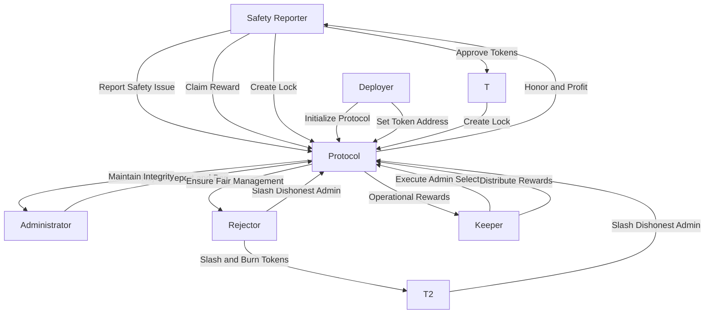

## Deployer
### initalize
function initialize(address tokenAddr) external onlyOnce

## Safety Reporters
### take and report a photo
function reportSafetyIssue(string memory description, string memory location, bytes memory photo) external;
### claim Reward
function claimReward() external;
### create Deposit
function createLock(uint amount, uint unlockTime) external;

## admin.
### rejectReportAndBan(address)
function rejectReportAndBan(address reporter, uint256 reportId) external;

## rejectReportAndBan function

### specify dishonest admin and slash
function slashDishonestAdmin(address admin) external;

## keeper.

### execute admin determination function
function executeAdminSelection() external;
### Execute reward distribution function
function distributeRewards() external;